# 3월 월간 보고서

# Kubernetes 기반의 클라우드 서비스 기술 연구

---

# 1. 학습내용

---

## Container

### Container

- 애플리케이션에 관련된 코드들이 해당 라이브러리 및 종속적인 항목들과 함께 **패키징**되어 있는 **소프트웨어 실행 단위**
- Container는 한 개의 호스트 컴퓨터에서 여러 개의 서비스들을 실행할 수 있도록 해주며, 이 서비스들은 모두 서로 **격리**되어 있다.
- **하나의 컨테이너**에서 **하나의 애플리케이션**만 실행시키는 것을 원칙으로 한다.
    - 하나의 컨테이너 내에서 여러 개의 애플리케이션을 실행시키는 것은 기술적으로 가능하지만, 이는 애플리케이션의 관리, 배포 및 확장에 일부 문제를 초래할 수 있다.
    - 또한 이는 애플리케이션들의 **독립성**을 목적으로 하는 컨테이너의 존재 이유에 반하는 것이라고 할 수 있다.

---

### Container와 Virtual Machine

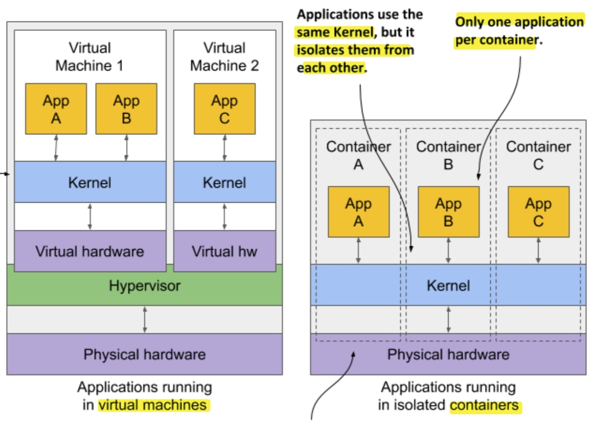

- **Virtual Machine**
    - 시작 시간이 길다.
    - 호스트 컴퓨터와 관계 없이 OS 선택이 가능하다.
    - 각각의 VM마다 격리된 커널을 사용한다.
    - 하나의 VM에 여러 개의 애플리케이션을 실행시킬 수 있다.
    - Hypervisor: 호스트 컴퓨터에서 다수의 OS를 동시에 실행하기 위한 논리적 플랫폼
- **Container**
    - 시작 시간이 짧다.
    - 호스트 컴퓨터와 동일한 OS만 사용 가능하다.
    - 호스트 컴퓨터 내의 컨테이너들이 모두 동일한 커널을 사용한다.
    - 하나의 Container에 한 개의 애플리케이션만 실행시키는 것을 원칙으로 한다.

---

### Image, Registry, Container의 관계

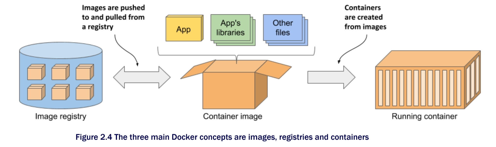

- **Image**: **애플리케이션**과 그 애플리케이션을 **실행하기 위한 환경**을 포함하는 가상 파일 시스템이다.
- **Registry**: Image의 **저장소**로, 관리자의 설정에 따라 public/private 할 수 있다.
- **Container**: Image를 실행하는 **런타임 환경**으로, **Image의 인스턴스**라고 할 수 있다.

---

### Image Layer에 대한 이해

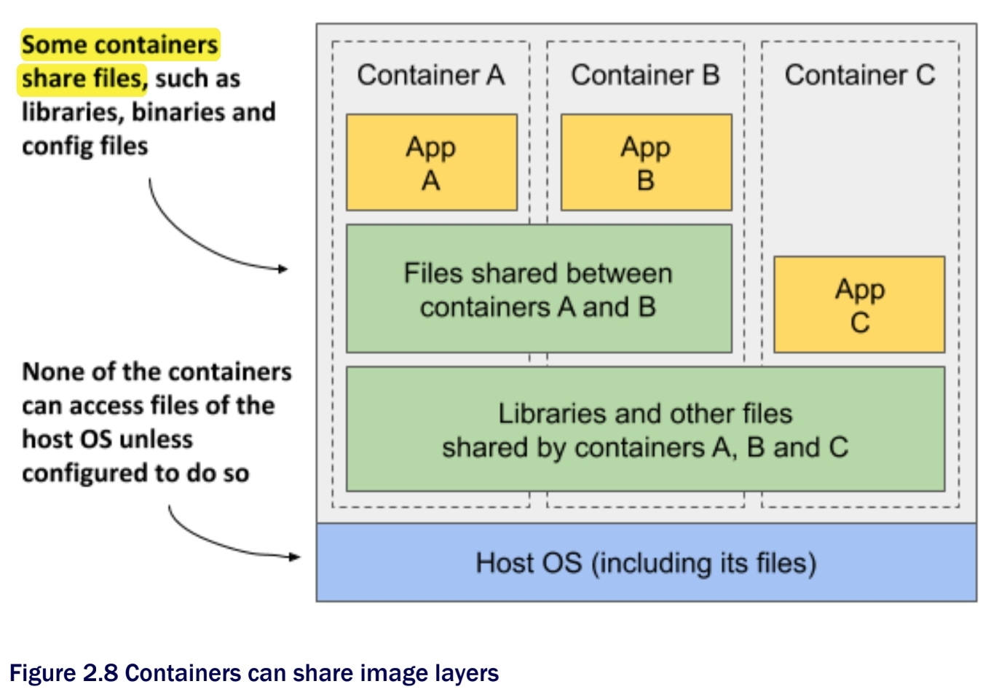

- VM의 Image가 OS가 필요로 하는 전체 파일 시스템을 큰 오브젝트로 관리하는 것과 달리, Container Image는 **여러 개의 층**(layer)으로 이루어져 있다.
- 또한, 여러 개의 층들은 여러 개의 이미지들에 의해 공유되어 질 수 있다.
- 공유되어지는 자원들에는 **Copy-on-Write** mechanism이 사용된다.

---

## Kubernetes의 등장 배경 및 소개

### 애플리케이션 배포 아키텍처의 변화

- **Monolithic Architecture**
    - 애플리케이션의 모든 구성 요소가 **하나의 프로젝트**에 통합되어 있는 기존의 architecture
    - 소규모 프로젝트에서는 합리적이지만, 프로젝트의 규모가 커질수록 복잡도가 증가하며, 빌드 시간 또한 증가한다.
- **MicroService Architecture(MSA)**
    - 작게 쪼개진 **여러 개의 서비스가 모여** 하나의 애플리케이션을 구성하는 architecture
    - 각 서비스들은 작고 **독립적**이며 **느슨하게 결합**되어(loosely coupled) 있다.
    - 서비스들이 독립적이라는 특징 덕에 클라우드, 컨테이너와 잘 어울리는 아키텍처

---

### Kubernetes의 필요성

- MSA의 시대가 도래하며 **컨테이너 사용량**이 폭발적으로 **증가**하게 된다.
- 기존의 방식에 비해 컨테이너가 효율적인 것은 맞지만, 컨테이너를 사용하기 시작하며 한 개  또는 여러 개의 **컨테이너에 대한 관리**가 또 하나의 해결해야 하는 과제로 남게 된다.

---

### Kubernetes란?

- **컨테이너화된 애플리케이션**을 쉽고 빠르게 **배포/확장**하고 **관리를 자동화**해주는 오픈소스 플랫폼으로, 컨테이너들을 쉽게 관리하고 연결하기 위해 논리적인 단위로 그룹화한다.
- **Kubernetes**의 역할
    1. **Service discovery**: 배포된 애플리케이션의 **위치**(IP, port)를 찾아내는 기능
    2. **Horizontal scaling**: load의 변동을 조절하기 위해 애플리케이션을 **복제**하는 기능
    3. **load-balancing**: 애플리케이션의 replica들을 통해 load를 **분산**시키는 기능
    4. **self-healing**: 오류가 발생한 애플리케이션을 자동으로 관리해주며 전체 시스템의 **동작을 유지**하는 기능
    5. **leader election**: **leader**(active한 애플리케이션)와 나머지(idle한 애플리케이션)를 정하는 기능

---

## Kubernetes Cluster Architecture

### Cluster

- Kubernetes 내에서 **가장 큰 단위**로, **서버들이 속한 클라우드**를 뜻한다.
- Master Node + Worker Node 라고도 할 수 있다.

---

### Control Plane

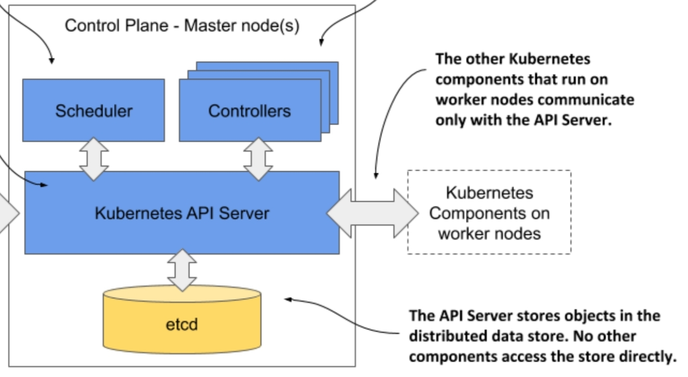

- **cluster를 관리**하는 plane
- **Scheduler**: 노드(Worker node)의 상태를 계속 체크하며 **어떤 서버에 어떤 컨테이너를 띄울지** 정한다.
- **Controller**: 논리적으로 특정 역할을 하는 다양한 종류의 controller가 존재하며, 클러스터의 상태를 감시하고 **현재 상태**와 **원하는 상태**(Desired State)가 **일치**하도록 관리한다.
- **API Server**: **etcd와 유일하게 통신하는 모듈**로, 클러스터에 관련된 상태를 조회하거나 바꿀 수 있는 **REST API**를 제공한다.
- **etcd**: API를 통해 만들어지거나 수정된 **모든 상태와 데이터를 저장**한다.(key-value 형태)

---

### Workload Plane

- **애플리케이션이 실행**되는 plane
- **Kubelet**: 각 노드마다 실행되어 **API server와 통신**하며 해당 노드에서 실행되고 있는 애플리케이션을 관리한다.
- **Kube Proxy**: 애플리케이션 간의 **load-balancing** 역할을 한다.
- **Container Runtime**: Docker가 image를 기반으로 container를 실행시키는 것처럼, **container**들이 **실행**될 수 있는 **환경**을 마련해 주는 소프트웨어이다.

---

## Kubernetes Objects

### 실행

### Node

- Cluster 내의 가상 서버로, **컴퓨팅의 엔진 단위**라고 할 수 있다.
- **Master** Node와 **Worker** Node로 분리되어 있다.

### Pod

- 가장 작은 배포 단위
- 각 pod마다 **고유한 IP**를 가진다.
- **한 개**의 컨테이너 또는 **여러 개**의 밀접한 관계가 있는 컨테이너들이 하나의 pod에 속한다.

---

### 배포

### ReplicaSet

- 여러 개의 pod를 관리한다.
- 신규 pod를 생성하거나 기존 pod를 제거하여 원하는 수(**Replicas**)를 유지한다.

### Deployment

- 배포 버전을 관리한다.
- 내부적으로 ReplicaSet을 이용한다.
- 엄밀히 말하면, **Deployment**는 **특정 갯수의 pod를 만드는 것 불과**하다.

---

### 노출

### Service

- pod를 통해 실행되고 있는 **애플리케이션을 네트워크에 노출**시키는 오브젝트
- pod는 IP가 랜덤하게 지정되고, restart 때마다 변하기 때문에 고정된 엔드포인트로 호출이 어렵다. 이 때, 클러스터 내부에서 **고정 IP**를 갖는 Service가 pod가 외부와 통신할 수 있도록 해준다.
- **Service**의 유형은 크게 4가지로 분류된다.
    1. **ClusterIP**(default): pod가 클러스터 내부의 다른 오브젝트들과 통신할 수 있도록 해준다.
    2. **NodePort**: IP의 특정 port로의 외부 요청을 감지하여 해당 pod에 알려준다.
    3. **LoadBalancer**: 외부 로드밸런서를 프로비저닝할 수 있게 해준다.
    4. **ExternalName**: selector 대신 DNS name을 직접 명시하고자 할 때에 쓰인다.

### Ingress

- IP와 port가 아닌 **도메인 또는 경로별 라우팅 기능**을 제공한다.
- 외부에서 Kubernetes 내의 Deployment, Service 오브젝트들에 접근하기 위한 **Gateway 역할**을 한다.
- Ingress를 사용하지 않고도 NodePort, ExternalName(L4)을 사용하여 외부 요청을 처리할 수 있지만, 네트워크 요청에 대한 **세부적인 처리 로직**을 구현해야할 때에는 Ingress(L7)를 사용한다.
- Ingress는 위의 기능들의 규칙들을 정의해둔 오브젝트이며, **Ingress Controller**가 위의 규칙들을 **실제로 동작**하게 해준다.

---

### 상태 전파

### Event

- Kubernetes 오브젝트들의 state 변화, 에러 등의 일어난 **event들에 대한 정보**를 포함한다.
- Controller가 관리하는 오브젝트에 생기는 event들에 대한 추가적인 정보들을 제공하기 위해 다양한 controller들로부터 생성된다.
- 만들어진 후 **1시간 뒤에 삭제**된다는 특징을 가지고 있다.

---

### 정보 및 저장

### Volume

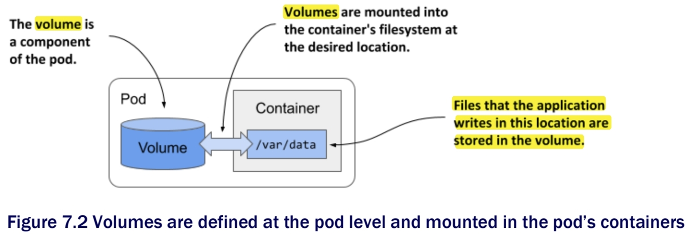

- pod 내부에 존재하는 오브젝트로, **데이터를 보관하고 공유**하기 위해 존재한다.
- 컨테이너는 종료되고 재시작될 때마다 컨테이너 내부의 filesystem의 변경 사항이 초기화된다는 특징이 있는데, Volume은 **재시작 시**에 이러한 **변경 사항을 유지**하도록 해준다.
- 모든 **Volume**들은 **pod가 생성된 후**, pod 내부의 **컨테이너들이 시작되기 전**에 생성된다.
- **하나의 컨테이너**에 **여러 개의 Volume**이 연결될 수 있으며, **하나의 Volume**은 **여러 개의 컨테이너**에 연결될 수 있다.
- **Volume**의 타입은 광범위하며, 각각의 종류는 서로 다른 데이터 저장 방식을 제공한다.
- **emptyDir**
    - pod가 실행될 때 임시 디렉토리를 생성하여 데이터를 저장하고, 이 디렉토리는 **pod가 종료될 때 함께 삭제**된다.
    - 생성 당시에 내부에 아무 내용이 없기 때문에 붙여진 이름이다.
- **hostPath**
    - 노드의 디스크에 Volume을 생성하여 **pod가 삭제되더라도 hostPath에 있는 파일들은 삭제되지 않고** 다른 pod가 같은 hostPath를 마운트한다면 남아 있는 파일에 액세스할 수 있다.
    - system-level log같은 **노드 자체에서 필요한 파일**들을 저장할 때에 쓰인다.

### ConfigMap

- **애플리케이션의 설정 정보**(환경 변수, 설정 파일, DB 연결 정보 등)를 저장해놓는 일종의 저장소 역할을 한다.(key-value 형태)
- 애플리케이션의 설정 정보를 분리함으로써 환경에 따라 다른 설정 정보를 사용하는 경우에도 애플리케이션을 쉽게 배포하고 관리할 수 있게 해준다.

### Secret

- 비밀번호, API key, SSH key 와 같은 **보안상 민감한 정보**를 저장하는 역할을 하고 pod에서 사용할 수 있도록 한다.

---

## Pod의 개요

### Pod의 유래

- **한 개의 컨테이너**에서 **한 개의 애플리케이션**만 실행시키는 것을 원칙으로 한다.
- 하지만, 여러 개의 컨테이너로 나누어진다고 하더라도 서로 **연관된 애플리케이션**들을 **함께** 실행할 수 있는 **상위 구조**(higher-level construct)가 필요하다.
- 그러한 상위 구조(**pod**) 내부의 컨테이너들은 서로 독립적이지만 특정 리소스들은 공유하며, 하나의 컨테이너에서 실행되는 것과 **거의 동일한 환경**을 제공 받을 수 있다.

---

### Pod가 여러 개의 컨테이너를 다루는 방법

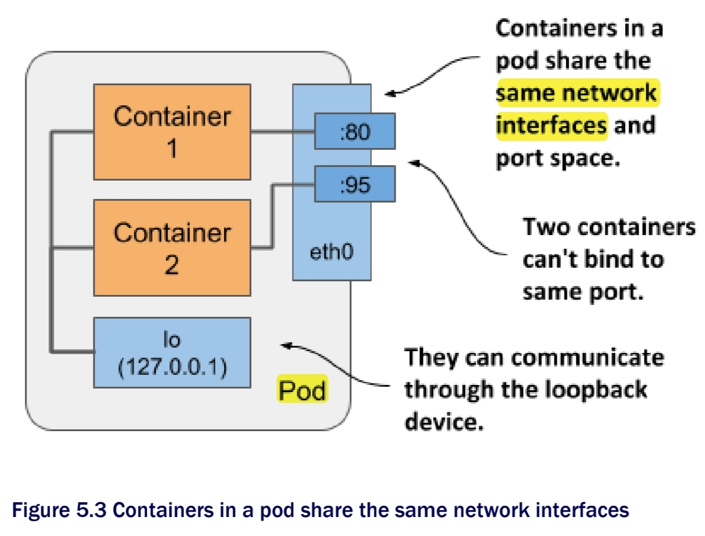

- 하나의 pod 안에 속한 컨테이너들은 **network interface**와 **port space**를 공유한다.
- port space를 공유하기 때문에, 각 **컨테이너들**은 **다른 port 번호**를 가진다.

---

### Sidecar Containers

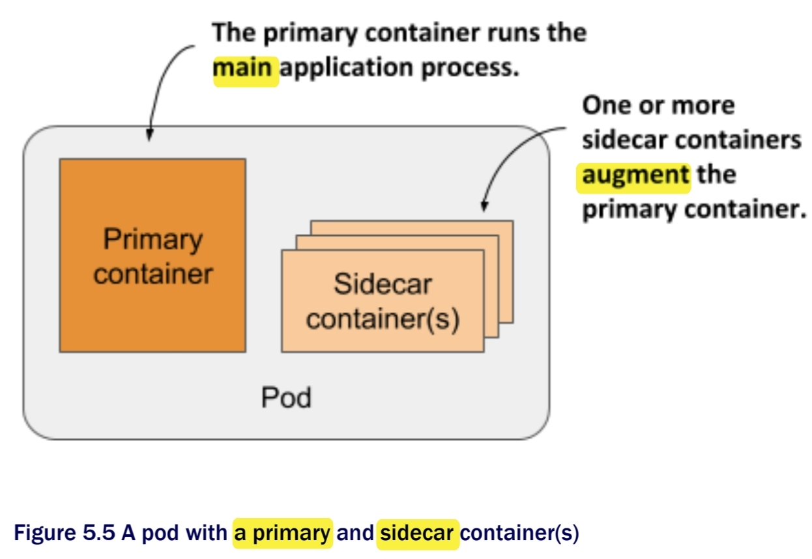

- **하나의 pod**에 **여러 개의 컨테이너**를 두는 것은 애플리케이션이 **한 개의 주요 프로세스**(primary process)와 **여러 개의 주요 프로세스를 보완해주는 프로세스**를 가질 때만 적합하다.
- 주요 프로세스를 보완해주는 프로세스가 존재하는 컨테이너를 **Sidecar Container**라고 한다.
- 기존 애플리케이션의 코드를 변경하는 것과는 달리, Sidecar 기법을 사용하면 추가적인 프로세스가 pod에서 실행되어야 하기 때문에  **pod의 리소스 요구사항이 증가**한다.

---

### Init Container

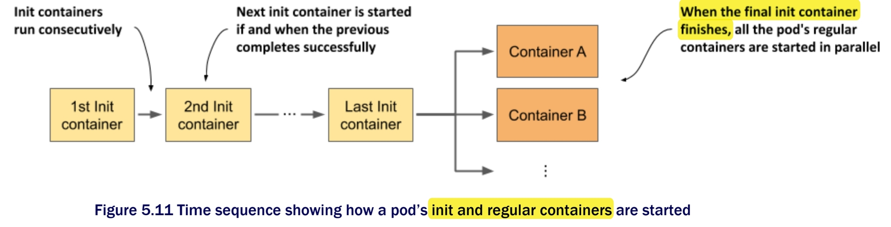

- pod 내의 **메인 컨테이너들이 실행되기 전**에 애플리케이션을 실행하기 위해 **필요한 초기화 작업**을 수행한다.
- **한 번에 한 개의 init container**만이 실행될 수 있다. (not in parallel)
- Init Container의 역할
    1. 메인 컨테이너에서 사용될 **Volume내의 파일들을 초기화**한다.
    2. pod의 **networking system을 초기화**한다.
    3. 메인 컨테이너의 **실행 요건이 충족될 때까지 시작을 보류**한다.
    4. pod가 실행되기 직전 **외부 서비스에 이를 알린다.**

---

## Pod의 Phase & Condition와 Container의 Status

### Pod Phase

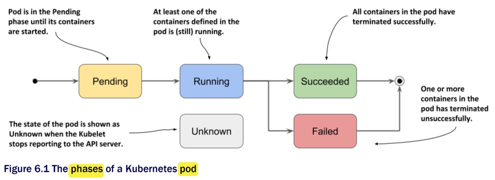

- **Pending**: pod의 생성 요청을 받았지만, **실행 준비를 마치지 못한 컨테이너가 존재**하는 상태
- **Running**: **최소 한 개**의 컨테이너가 실행중이거나 **시작 또는 재시작 중**인 상태
- **Succeeded**: 모든 컨테이너가 **성공적으로 종료**되었으며, 재시작할 필요가 없는 상태
- **Failed**: 모든 컨테이너가 **종료되었으나**, 한 개 이상의 컨테이너가 **비정상적으로 종료**된 상태
- **Unknown**: pod의 **상태 정보를 읽어오지 못하는 상태**(주로 Kubelet이 API server로와의 통신을 하지 못해 발생)

---

### Pod Condition

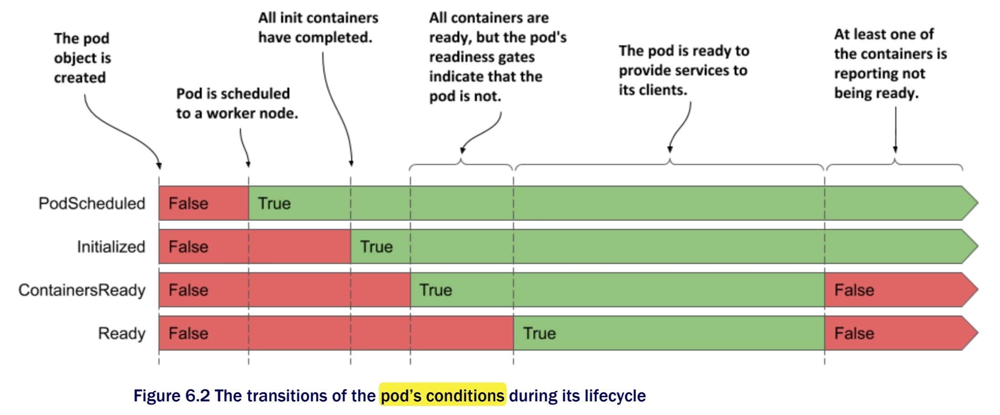

- phase와 다르게, pod는 **동시에 여러 개의 condition**을 가질 수 있다.
- **PodScheduled**: pod가 **node에 배정**되었는지 확인
- **Initialized**: pod의 **모든 init container**들이 **성공적**으로 실행됨
- **ContainersReady**: pod의 **모든 container**들이 **ready** 상태인지 확인
- **Ready**: pod가 **서비스를 제공**할 수 있는 상태

---

### Container Status

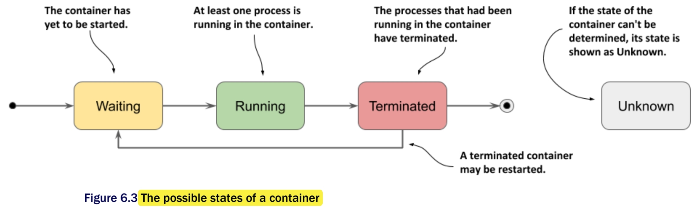

- **Waiting**: 컨테이너가 시작되기를 **기다리는** 상태
- **Running**: **컨테이너가 모두 생성**되고 **프로세스들이 실행**되는 상태
- **Terminated**: 실행중이던 프로세스들이 **모두 종료**된 상태
- **Unknown**: 컨테이너의 상태를 명확히 **정할 수 없는** 상태

---

## Pod의 Lifecycle

### Pod의 restart policy

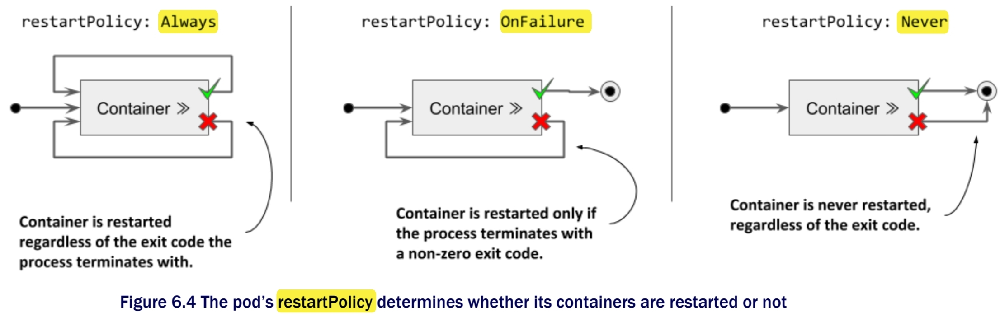

- **Always**(default): 컨테이너가 exit code에 관계없이 재시작된다.
- **OnFailure**: 컨테이너가 0이 아닌 exit code를 가질 때 재시작된다.
- **Never**: 컨테이너가 재시작되지 않는다.

---

### Liveness Probe

- Container의 상태를 **주기적으로 체크**하며 응답이 없으면 Container를 **자동으로 재시작**한다.
- **HTTP GET probe**: Container의 IP 주소로 GET 요청을 보낸다.
- **TCP Socket probe**: Container의 특정한 port로 TCP 연결을 시도한다.
- **Exec probe**: Container 내에서 특정 명령을 실행시키고 종료될 때의 exit code를 체크한다.

---

### Startup Probe

- Container 내의 애플리케이션이 **시작되었는지를 체크**한다.
- Startup Probe가 주어지면 성공할 때까지 **다른 종류의 probe는 활성화되지 않는다.**
- 서비스를 **시작하는 데에 오랜 시간**이 걸리거나 **불규칙적**인 Container를 설정하는 데에 사용될 수 있다. (ex. 외부에서 특정 데이터를 다운받는 경우)

---

### Container Lifecycle의 전후 처리

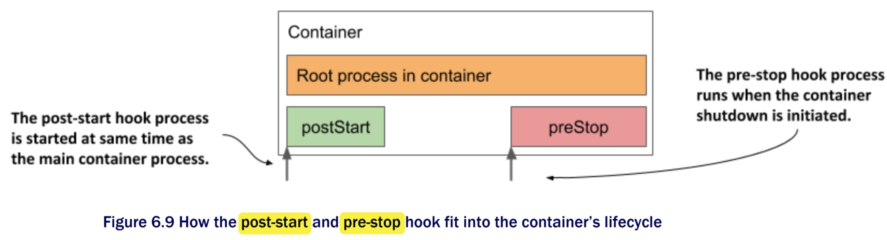

- **post-start hook**
    - container가 **생성된 직후** 실행되는 hook으로 **main container와 비동기적**으로 실행된다.
    - container 프로세스의 초기화 시간을 확보하기 위해 **시작 상태를 지연**시킨다.
    - pod가 전제조건을 충족하지 못했을 때 **container가 시작되지 않도록** 한다.
- **pre-stop hook**
    - container가 **종료되기 직전** 실행되는 hook
    - DB 및 WebSocket 연결 중지, 현재 상태 저장 등을 수행한다.

---

### Pod의 전반적인 Lifecycle

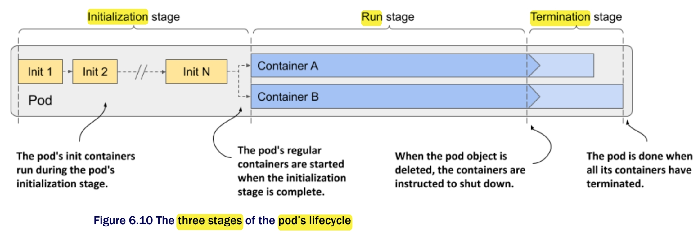

- **Initialization Stage**: pod의 init container들이 실행된다.
- **Run Stage**: pod의 일반적인 container들이 실행된다.
- **Termination Stage**: pod의 컨테이너들이 종료된다.

---

# 2. Kubernetes CRD

---

## Resource

- Kubernetes API의 Endpoint이자 특정 API Object의 집합

## Custom Resource

- Kubernetes API가 기본적으로 제공하는 Resource 외에 유저가 **필요로 하는 기능을 직접 구현**한 Resource
    - Kubernetes는 기본적으로 Pod, Service, Deployment와 같은 리소스 유형을 제공한다.
    - 하지만 이러한 기본 리소스 유형만으로는 **실무에서 발생하는 문제**들에 대응하기 어려울 수 있다.
- Kubernetes는 **오픈소스**라는 특징을 유지하기 위해 사용자가 필요한 기능을 직접 구현할 수 있도록 설계됨

## CRD(Custom Resource Definition)

- Custom Resource를 정의하는 API
- 생성된 Custom Resource은 **Kubernetes 클러스터**에서 생성, 수정 및 삭제할 수 있다.
- 사용자는 생성한 Custom Resource에 대한 **자체 Controller**를 만들어 해당 리소스에 대한 작업을 수행할 수 있다.
- CRD는 Kubernetes API에 새로운 리소스 유형을 추가하기 위해 필요한 **구조체**(json, yaml)**와 관련 메타데이터를 포함**한다.
- CRD Object의 이름은 **유효한 DNS Subdomain name**이어야 한다.

## CRD 사용 예시

- Prometheus

    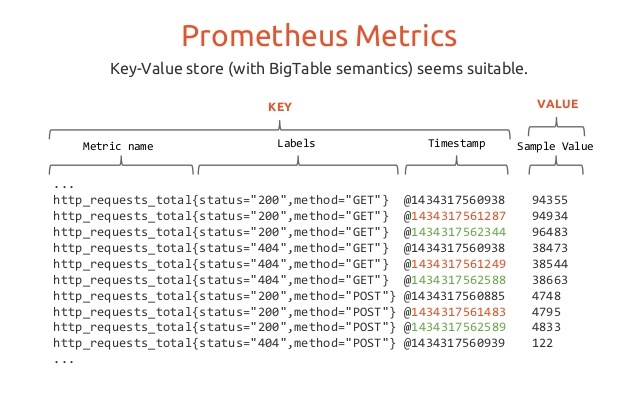
    
    - **메트릭** 기반의 오픈 소스 모니터링 시스템으로, **분산**된 서비스 아키텍처의 **모니터링** 및 **경고**에 사용된다.
    - **메트릭**은 Prometheus에서 **정보**를 **수집**하고 **저장**하는 **기본 단위**
        - 모니터링 대상의 **측정 가능**한 **값**이나 **정보**
        - 예시) CPU 사용률, 메모리 사용률, 요청 수, 지연 시간
    - 시간 경과에 따른 메트릭의 **변화를 추적**하고, 이러한 메트릭을 쿼리하여 측정값의 분포, 합계, 평균 등을 계산하고 시각화할 수 있다.
        - 수집된 메트릭 정보들은 **시계열 DB에 저장**되어 **PromQL**을 통해 조회 가능
    - Prometheus CRD를 정의함으로써 Prometheus 서버, 구성 및 대상을 정의하고, 서버에 로드할 추가적인 파일을 지정할 수 있다.
