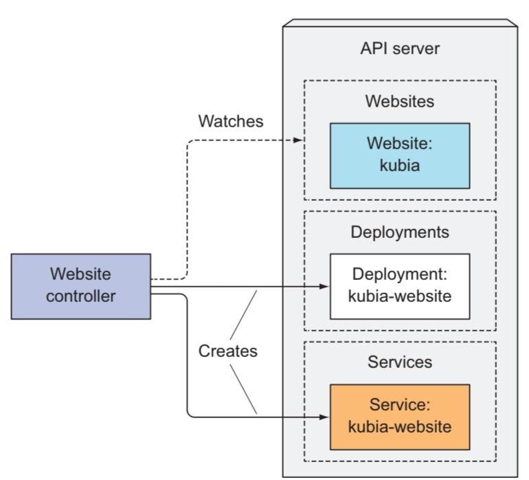
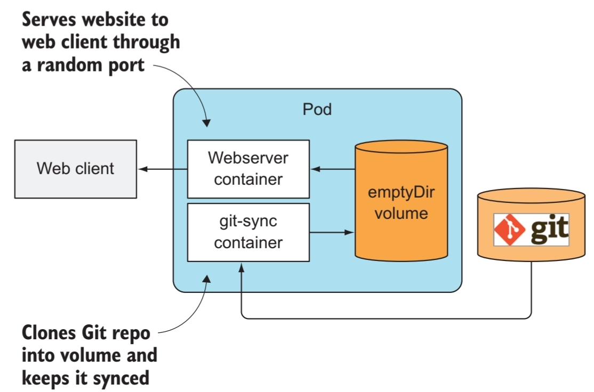

# 4월 월간 보고서


## Custom Resource Definition (CRD)

- Kubernetes의 ecosystem이 발전함에 따라, 우리는 기존에 Kubernetes가 제공하는 상대적으로 **low-level**인 object 이외에 어떠한 용도에 **특화**된 상대적으로 **high-level**인 object를 필요로 한다.
- **새로운 타입의 resource**를 정의하고 싶을 때, **CRD object**를 Kubernetes API server에 등록함으로써 Custom Resource를 정의 및 사용할 수 있다.
- Kubernetes 내의 주요한 **resource**들이 연관된 **Controller**를 갖고 있는 것과 마찬가지로, 각각의 CRD는 **자신과 연관된 Controller를 필요**로 한다.

### CRD의 웹사이트에서의 단편적 예시

1. Custom Resource Definition manifest
    - apiVersion에서 / **앞 부분은 API group**을, **뒷 부분은 version name**(or number)을 뜻한다.
    - **kubectl 커맨드**를 사용하여 CRD를 생성할 수 있다.
    - CRD object를 생성하고 API server를 통해 custom object들을 **저장, 조회, 삭제**할 수 있다.
    - 하지만 **연관된 Controller를 설정**하기 전까지, 이들은 실제로 어떠한 작업도 수행할 수 없다.
    
    ```yaml
    apiVersion: apiextensions.k8s.io/v1beta1
    kind: CustomResourceDefinition
    metadata:
    	name: websites.extensions.example.com
    spec:
    	scope: Namespaced
    	group: extensions.example.com
    	version: v1
    	names:
    		kind: Website
    		singular: website
    		plural: websites
    
    # A CustomResourceDefinition manifest: website-crd.yaml
    
    $ kubectl create -f website-crd.yam
    ```
    
2. Create/Retrieve/Delete an instance of a Custom Resource
    - kind가 Website인 **CustomResource instance에 대한 yaml 파일**을 생성 후 kubectl 커맨드를 이용하여 그에 대한 **생성/조회/삭제**를 할 수 있다.
    
    ```yaml
    apiVersion: extensions.example.com/v1
    kind: Website
    metadata:
    	name: kubia
    spec:
    	gitRepo: https://github.com/luksa/kubia-website-example.git
    
    # A custom Website resource: kubia-website.yaml
    
    $ kubectl create -f kubia-website.yaml # Create
    $ kubectl get websites # Retrieve
    $ kubectl get website kubia -o yaml # Retrieve
    $ kubectl delete website kubia # Delete
    ```
    

## Custom Controller를 이용한 Custom Resource 자동화



- 앞서 생성한 CRD object가 **Service**를 통해 노출되는 **pod를 실행**하기 위해서는 **Custom Controller를 빌드 후 배포**해야 한다.
- **Custom Controller**는 **Custom Resource object의 생성이 일어나는지**를 지속적으로 **감시**하고 **Custom Resource object가 생성**되면 **각각의 object들**에 대하여 **Service와 웹 서버 Pod를 생성**한다.

## 해당 예시 Controller의 역할



- 생성된 Website object에 변경 사항이 생기면, API server는 **watch event**를 보낸다.
- Controller가 해당 **event를 수신**하면, **Deployment**와 **Service** object를 생성한다.
    - Deployment resource는 2개의 container에 대한 정보를 포함한다.
        - **nginx 서버를 실행**하기 위한 container
        - **git-sync process**를 실행하기 위한 container
    - Service의 종류는 **NodePort**로, web server pod를 노출시켜준다.
- 이러한 과정을 통해 pod의 생성이 완료되면, 클라이언트는 생성된 node port를 통해 웹사이트에 접속할 수 있다.

## Controller를 pod로 실행시키기

- Kubernetes에서 controller를 실행시키기 위해서 **Deployment** resource를 통해 배포할 수 있다.
- 해당 예시의 Deployment는 2개의 컨테이너를 가진 pod의 1개의 replica를 배포한다.
    1. Custom Controller를 실행하는 컨테이너
    2. API server와 통신하기 위한 sidecar 컨테이너

```yaml
apiVersion: apps/v1beta1
kind: Deployment
metadata:
	name: website-controller
spec:
	replicas: 1
	template:
		metadata:
			name: website-controller
			labels:
				app: website-controller
spec:
	serviceAccountName: website-controller
	containers:
		- name: main
			image: luksa/website-controller
		- name: proxy
			image: luksa/kubectl-proxy:1.6.2
```

## Validating custom objects

- **API server**는 yaml파일의 **일반적인 필드**(apiVersion, kind, metadata) **외에는 validation을 하지 않기 때문에** user가 invalid한 custom object를 생성할 수 있었다.
- 그렇다면 controller에 validation 기능을 추가하는 방법을 생각할 수 있다.
    - 하지만 이는 API server가 object를 먼저 저장한 후에 클라이언트(kubectl)에게 response를 전달하기 때문에 불가능하다.
- Controller는 유일하게 **watch event**를 받을 때에만 object에 대한 validation을 할 수 있었다.
    - 하지만 **validation의 결과**를 **사용자가 직접** API server로의 **요청을 통해 확인**해야 한다는 불편함이 있다.
- 이러한 불편함을 보완하기 위해 **API server가 validation**을 하고 **invalid한 custom object**에 대한 요청을 **즉시 reject**하는 **custom object의 Validation 기능**이 Kubernetes 1.8 버전에 도입되었다.
    - **CustomResourceValidation** **feature**를 활성화함으로써 위의 기능을 사용할 수 있다.

## 또 다른 CRD 예시1: EtcdBackup

- Kubernetes 클러스터의 주요 구성 요소인 etcd를 백업하는 데에 사용되는 ‘EtcdBackup’
- 아래 예시는 ‘EtcdBackup’ Custom Resource을 정의하고, 이를 통해 ‘my-backup’이라는 Custom Resource의 인스턴스를 생성한다.
- **etcdEndpoints**에 etcd 엔드포인트를 지정하며 백업 데이터를 저장할 S3 버킷을 지정한다.
1. CRD 생성
    
    ```yaml
    apiVersion: apiextensions.k8s.io/v1
    kind: CustomResourceDefinition
    metadata:
      name: etcdbackups.stable.example.com
    spec:
      group: stable.example.com
      version: v1
      scope: Namespaced
      names:
        plural: etcdbackups
        singular: etcdbackup
        kind: EtcdBackup
    ```
    
2. EtcdBackup resource 생성
    
    ```yaml
    apiVersion: stable.example.com/v1
    kind: EtcdBackup
    metadata:
      name: my-backup
    spec:
      etcdEndpoints:
      - https://etcd-cluster-1:2379
      - https://etcd-cluster-2:2379
      - https://etcd-cluster-3:2379
      storage:
        bucket: my-backup-bucket
    ```
    
## 또 다른 CRD 예시2: PrometheusRule

1. CRD 생성

    ```yaml
    apiVersion: apiextensions.k8s.io/v1
    kind: CustomResourceDefinition
    metadata:
      name: prometheusrules.monitoring.coreos.com
    spec:
      group: monitoring.coreos.com
      version: v1
      scope: Namespaced
      names:
        plural: prometheusrules
        singular: prometheusrule
        kind: PrometheusRule
    ```

2. PrometheusRule resource 생성

    ```yaml
    apiVersion: monitoring.coreos.com/v1
    kind: PrometheusRule
    metadata:
      name: my-rule
    spec:
      groups:
      - name: example
        rules:
        - alert: HighErrorRate
          expr: job:request_error_rate{job="myjob"} > 0.5
          for: 5m
          labels:
            severity: critical
          annotations:
            summary: High request error rate on {{ $labels.instance }}
            description: "{{ $value }} errors in {{ $value | humanizeDuration }} on {{ $labels.instance }}"
    ```

  - Prometheus 서버에서 사용되는 규칙을 정의하는 'PrometheusRule'
  - **HighErrorRate**라는 경고 규칙을 정의한다.
      - 이 경고는 "myjob"이라는 이름의 측정 항목에서 **오류가 0.5를 초과하는 경우** 5분 동안 지속된다.
      - **severity** 라벨이 **critical**로 지정되고, error와 관련된 설명이 포함된 어노테이션도 제공된다.